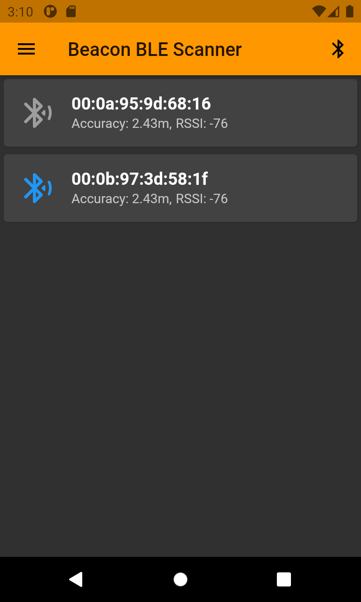

# iBeacon Reader

## The Idea

This project is a Flutter application with the aim of testing the ease with which the data of a BLE Beacon can be read.
Due to used libraries, the App is only runnable on Android.

The application allows the user to enter a list of regions and scan them, finding the iBeacons whose identifier matches with the Region's ones

Library used to managing the scan:
- [flutter_beacon 0.3.0](https://pub.dev/packages/flutter_beacon)

## The Application

The first time you run the application, you will find an icon who tells you to allow the app to access the device's location and to activate the Bluetooth.
This is required for the application to run properly.
Once given all the permission, then it will start to scan Beacons in the Regions stored in the app. 

  
  
  

Now, tap on the drawer icon o the top left, where you will find three options:
- "Manage Regions" leads you to another page, where you can add or delete the Regions to scan
- "Dark Theme" allows you to change the theme of the app if enabled
- "More Info" redirects you to a page where are listed all the licenses

  
  
  

## Personalization

To see on screen your first Beacon, you need at least one Region to scan.
Tap on "Manage Regions" in the drawer and then you will be able to add (or delete by swiping left) all the regions you want.
Remember that a Region has a specific UUID which is composed by 32 hexadecimal characters!

  
  

Once you have added at least one region, on the home page you'll find the compatible Beacons!
Tapping on them you can see all their characteristics and you can also save them in local, so you can keep track of the Beacon even when the app doesn't find it.

In the home page, the Beacons that are actually scanned have a colored Bluetooth icon at the left.
If a Beacon is not found but is local saved, the Bluetooth icon will be grey.

  
  
  

